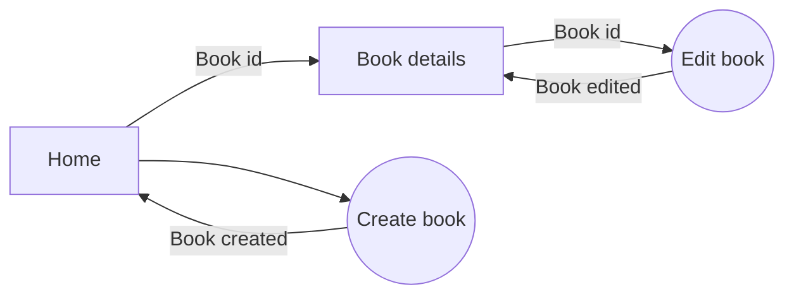

# Bookstore App v2

This is a CRUD application for managing a bookstore, developed with Next.js 13.5

## Table of Contents
1. [Getting Started](#getting-started)
2. [Dependencies](#dependencies)
3. [Local Implementation](#local-implementation)
4. [How to Use](#how-to-use)
5. [Technologies used](#technologies-used)
6. [App workflow](#app-workflow)
7. [Contributing](#contributing)
   
## [Getting Started](#getting-started)
To get started with the Bookstore App v2, follow the steps below.

### [Dependencies](#dependencies)
Make sure you have the following dependencies installed:
```json
{
  "dependencies": {
    "@uploadthing/react": "^5.7.0",
    "mongoose": "^7.6.3",
    "next": "13.5.6",
    "react": "^18",
    "react-dom": "^18",
    "uploadthing": "^5.7.2"
  },
  "devDependencies": {
    "@types/node": "^20",
    "@types/react": "^18",
    "@types/react-dom": "^18",
    "autoprefixer": "^10",
    "eslint": "^8",
    "eslint-config-next": "13.5.6",
    "postcss": "^8",
    "tailwindcss": "^3",
    "typescript": "^5"
  }
}
```

### [Local Implementation](#local-implementation)

1.  Clone this repository:
    
    `git clone https://github.com/JohnFScha/bookstore-app-v2.git` 
    
2.  Change to the project directory:
    
    `cd bookstore-app-v2` 
    
3.  Install dependencies:
    
    `npm install`
    or
    `yarn install`
    or
    `pnpm install` 
    
4.  Start the development server:
    
    `npm run dev`
    or
    `yarn dev`
    or
    `pnpm dev`
    or
    `bun dev` 
    
5.  Open your web browser and go to [http://localhost:3000](http://localhost:3000/) to see the application.
    

## [How to Use](#how-to-use)

You can start managing your bookstore using the web interface. The app provides CRUD (Create, Read, Update, Delete) functionality for books. On the main page the books will be listed in a table, you can either edit, delete or see more info from this interface. You can also add a new book clicking the button below the table. From the single book view you can also edit or delete the selected book.

On the main page one can look for a specific book title with the search bar. The app also has a smooth jazz playlist, and on the header there's also a toggle button for changing dark and light themes.

## [Technologies used](#technologies-used)

- [React](https://react.dev/): Frontend library for creating reusable components built on top of JavaScript. 

- [Next.js](https://nextjs.org/): React framework that enables the use of Server Side Rendering (SSR) by creating Server Components which are created and sent directly from the server. This approach has many benefits, for one it creates a fast workflow as the data is directly served without any javascript bundles on compile time. Furthermore it enables better SEO as metadata is created and sent from the server as well.

- [MongoDB](https://www.mongodb.com/): Non relational database for managing book information. The data is stored and returned in a JSON format which is in accordance with web formatting standards.

- [Mongoose](https://mongoosejs.com/): MongoDB ORM which defines and manages stored object models. Through its interface, mongoose connects to the database to store and retreive information based on the defined object structure. By its implementation the four basic methods GET, POST, PUT and DELETE are enabled for the user.

- [UploadThing](https://uploadthing.com/): File upload and hosting for full stack typescript apps. This file manager allows for easy file upload for both client and server components. The returned URL for the hosted file is used for the book cover and sent to the DB after correct upload.

- [Tailwind.css](https://tailwindcss.com/): CSS library for styling components using the `className` prop on the returned JSX. This library has the benefit of co-location, allowing the developer to directly style the component from the component file.

- [DaisyUI](https://daisyui.com/): Tailwind.css based UI library, with pre defined classNames which apply reusable and customizable styles. It also comes with themes which are directly applied on the main HTML file.

## [App workflow](#app-workflow)

This a crude representation of the app worklow



## [Contributing](#contributing)

We welcome contributions to improve the Bookstore App v2. Feel free to create issues or pull requests on the [GitHub repository](https://github.com/JohnFScha/bookstore-app-v2).
