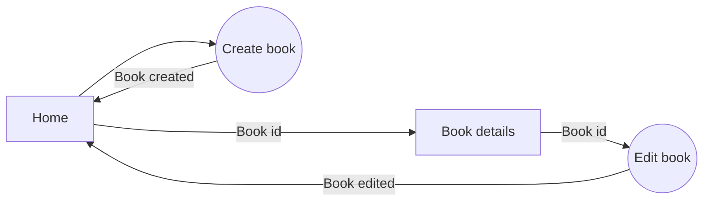

# Bookstore App v2

This is a CRUD application for managing a bookstore, developed with Next.js 13.5

## Table of Contents
1. [Getting Started](#getting-started)
2. [Dependencies](#dependencies)
3. [Local Implementation](#local-implementation)
4. [How to Use](#how-to-use)
5. [App workflow](#app-workflow)
6. [Contributing](#contributing)
7. [License](#license)

## [Getting Started](#getting-started)
To get started with the Bookstore App v2, follow the steps below.

### [Dependencies](#dependencies)
Make sure you have the following dependencies installed:
```json
{
  "dependencies": {
    "@uploadthing/react": "^5.7.0",
    "mongoose": "^7.6.3",
    "next": "13.5.6",
    "react": "^18",
    "react-dom": "^18",
    "uploadthing": "^5.7.2"
  },
  "devDependencies": {
    "@types/node": "^20",
    "@types/react": "^18",
    "@types/react-dom": "^18",
    "autoprefixer": "^10",
    "eslint": "^8",
    "eslint-config-next": "13.5.6",
    "postcss": "^8",
    "tailwindcss": "^3",
    "typescript": "^5"
  }
}
```

### [Local Implementation](#local-implementation)

1.  Clone this repository:
    
    `git clone https://github.com/JohnFScha/bookstore-app-v2.git` 
    
2.  Change to the project directory:
    
    `cd bookstore-app-v2` 
    
3.  Install dependencies:
    
    `npm install
    ### or
    yarn install
    ### or
    pnpm install` 
    
4.  Start the development server:
    
    `npm run dev
    ### or
    yarn dev
    ### or
    pnpm dev
    ### or
    bun dev` 
    
5.  Open your web browser and go to [http://localhost:3000](http://localhost:3000/) to see the application.
    

## [How to Use](#how-to-use)

You can start managing your bookstore using the web interface. The app provides CRUD (Create, Read, Update, Delete) functionality for books.

## [App workflow](#app-workflow)



## [Contributing](#contributing)

We welcome contributions to improve the Bookstore App v2. Feel free to create issues or pull requests on the [GitHub repository](https://github.com/JohnFScha/bookstore-app-v2).

## [License](#license)

This project is licensed under the Open Source License.
 
`Feel free to customize this README further to fit your project's specific details and requirements.`

